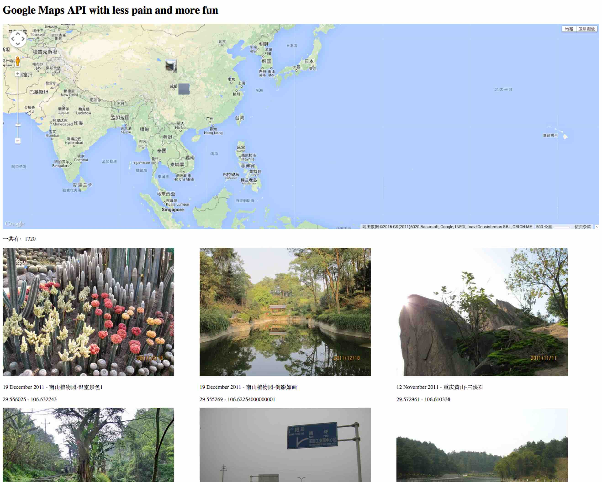
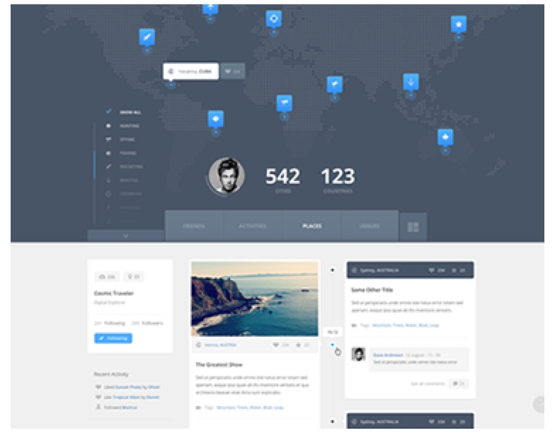

## WHY
自己喜欢出去玩，去收集有地方特色的照片（主要是自然风光的），一些美图罗列在 Maps， 有事没事的时候去满地图的欣赏~
PS: 也学习下 GMap 开发

### Data Source

- panoramas
- qyer's POI?!(或其他旅游网站的)
- 自己的数码照片

### Screencast

### Ref
flickr pictures taken nearby
Request URL:https://api.flickr.com/services/rest?method=flickr.photos.search&format=json&api_key=a52bddc9b8e8be0556b8bd2a210f75e3&nojsoncallback=1&per_page=5&lat=22.5429282&lon=113.932356618&radius=.25&radius_units=km&min_upload_date=1999-02-02

fs.writeFileSync('qyer-countries.json',JSON.stringify(allRespMap.country),{encoding:'utf8'})

### Tip
记住打断点和打 log，记录抓取情况。自己在一开时候的不清楚直接审查 qyer 页面的时候有些属性貌似是动态生成的，那么在代码中就没有获取到，导致很长时间的 debuger!